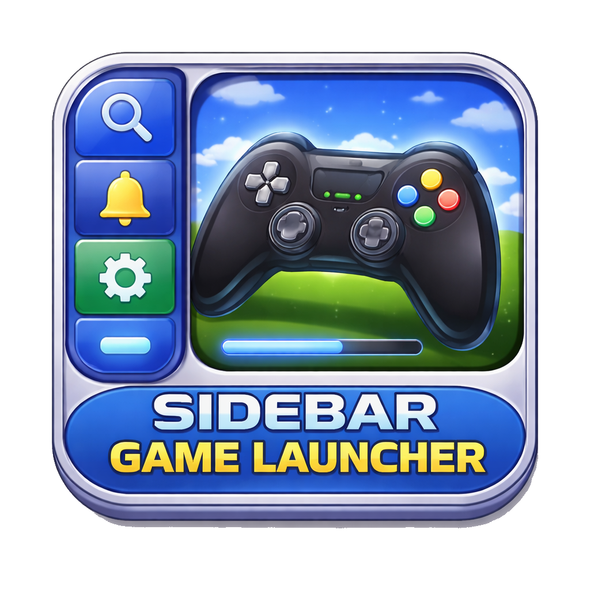
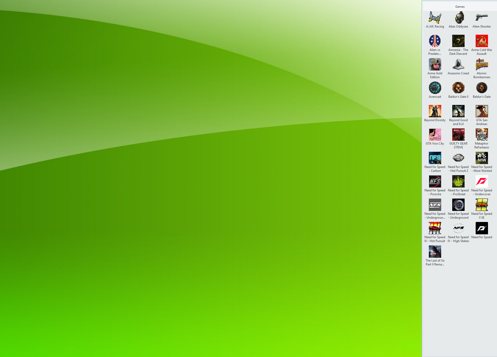

# Sidebar Game Launcher

<p align="center">
  
</p>

A sidebar launcher inspired by classic Windows XP folder toolbars.

## Preview



## Interface

- Minimal sidebar window (no in-window buttons)
- All controls live in the tray icon menu
- Double-click a game icon (or press Enter) to launch

Tray actions:
- Show / Hide Sidebar
- Choose Folder
- Refresh
- Pin / Unpin On Top
- Exit

## Style

- Aero-glass inspired blue gradient panel
- Frutiger-style UI feel (Segoe UI/Tahoma fallback)
- Clean icon display without forced shortcut overlay flag

## Persistence

Saved automatically in `Data\\settings.ini` (portable, next to exe):
- Last selected folder
- Sidebar position (Left/Top)
- Sidebar size (Width/Height)
- TopMost pin state

## Compatibility target

- Framework: .NET Framework 4.0
- Architecture: x86 (32-bit friendly)
- Intended OS range: Windows XP SP3 32-bit through Windows 11

## Supported launch items

- `.exe`
- `.lnk`
- `.url`
- `.bat`
- `.cmd`
- `.com`
- `.msi`

## Build

Use MSBuild:

```powershell
& 'C:\Program Files (x86)\Microsoft Visual Studio\2022\BuildTools\MSBuild\Current\Bin\MSBuild.exe' 'SidebarGameLauncher.csproj' /t:Rebuild /p:Configuration=Release /p:Platform=x86
```

Output:
- `bin\\Release\\Sidebar Game Launcher.exe`
